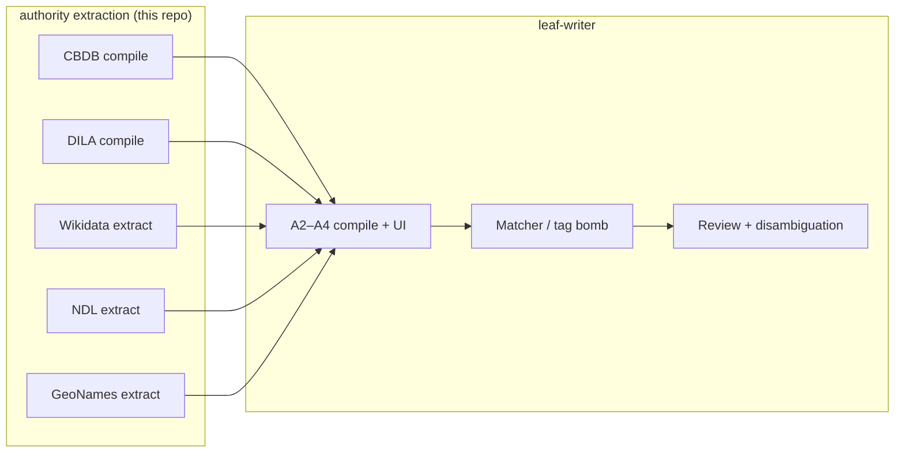
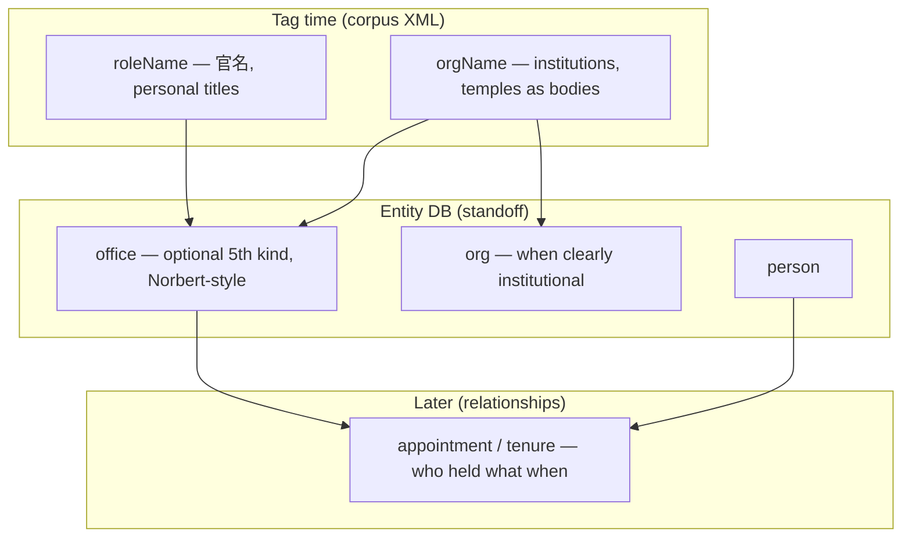

# Authority extraction — phases

Status: **in progress** (2026-07-05).  
**Repo:** `authority extraction` (this folder).  
**Consumer:** [LEAF/LJB](../leaf-writer) tag bomb + disambiguation.

This document is the **master roadmap for building packs offline**. It is organized so work alternates between **automated build steps** and **points where your judgment matters** — policy choices, spot-checks on real corpus text, and go/no-go before the next segment.

---

## Progress dashboard


| Track          | Phase      | Status                                                        | Output                                                         |
| -------------- | ---------- | ------------------------------------------------------------- | -------------------------------------------------------------- |
| **C** CBDB     | C0 policy  | **built** — defaults in `[cbdb/README.md](../cbdb/README.md)` | 👤 confirm or override                                         |
| **C**          | C1 compile | **done**                                                      | `packs/cbdb/` — 659,053 persons, 29,717 places, 33,767 offices |
| **C**          | C2 report  | **built**                                                     | `reports/cbdb-ambiguous-top100.csv` — 👤 review                |
| **C**          | C3 publish | **CI pipeline ready** — artifacts on main; Release when ready | [docs/ci-packs.md](../docs/ci-packs.md)                        |
| **D** DILA     | D0 rules   | **built** — `[dila/README.md](../dila/README.md)`             | 👤 mythical names?                                             |
| **D**          | D1 compile | **done**                                                      | `packs/dila/` — 49,060 persons, 59,277 places                  |
| **D**          | D2 overlap | **policy locked** — crosswalk-only auto-merge                 | LJB `authorityOverlap.ts`                                      |
| **D**          | D3 publish | **CI pipeline ready** — bundled with C3                       | same as C3                                                     |
| **W** Wikidata | W0 tables  | **done**                                                      | `wikidata/*.json`                                              |
| **W**          | W1+        | not started                                                   | —                                                              |
| **L** LJB      | A2 loader  | **built**                                                     | wire + dialog; sync packs to entity DB                         |


**Commands:**

```bash
npm test                  # unit tests (CBDB + DILA fixtures)
npm run compile:cbdb      # ~7s → packs/cbdb/
npm run compile:dila      # ~3s → packs/dila/
node cbdb/report.mjs      # ambiguity CSV
```

**Your next validation (~30 min):** see [✓ Validation queue](#validation-queue) below.

---

- [authority-packs-planning.md](../leaf-writer/docs/authority-packs-planning.md) — strategy & source feasibility
- [authority-databases-phases.md](../leaf-writer/docs/authority-databases-phases.md) — in-app download, matcher, UI (tracks **A**, **L**)
- [wikidata-tag-packs-planning.md](../leaf-writer/docs/wikidata-tag-packs-planning.md) — Wikidata design detail

---

## How to read this doc

Each **track** is one authority source (or family). Phases are numbered within the track.


| Symbol         | Meaning                                                    |
| -------------- | ---------------------------------------------------------- |
| **Build**      | Code or config we implement                                |
| **👤 Decide**  | You choose policy before we continue                       |
| **✓ Validate** | You review samples / run gold passage — gate to next phase |
| **→ LJB**      | Handoff to leaf-writer integration (not built here)        |


**Priority order:** Chinese biographical corpora first (CBDB + DILA), then one Wikidata slice to prove generalization, then Japanese (NDL), then global/Tibetan supplements.

---

## Cross-track overview




| Track | Source        | Best for                           | Extraction repo | LJB integration        |
| ----- | ------------- | ---------------------------------- | --------------- | ---------------------- |
| **C** | CBDB          | Chinese persons, places, offices   | C0–C3           | A2–A5 (partially done) |
| **D** | DILA          | Chinese persons, places, crosswalk | D0–D3           | A2–A5                  |
| **W** | Wikidata      | Long tail, ja/bo/en, works         | W0–W5           | L1–L2                  |
| **N** | NDL           | Japanese persons/places            | N0–N4           | L3                     |
| **G** | GeoNames      | Global modern places               | G0–G3           | L4                     |
| **T** | THL / Tibetan | Himalayan places                   | T0–T2           | deferred               |
| **L** | —             | Install packs, panel UI, tag bomb  | —               | A2–A5, L1–L4           |


---

## Track C — CBDB (Chinese Biographical Database)

**Raw input:** HuggingFace CBDB sqlite (~550 MB).  
**Target packs:** `cbdb-persons`, `cbdb-places`, `cbdb-offices`.

### C0 — Extraction policy — **signed (2026-07-05)**

**Build:** `[cbdb/README.md](../cbdb/README.md)` + `[cbdb/personAltNames.mjs](../cbdb/personAltNames.mjs)`.

**Locked for v1:**

- [x] Exclude altname type **0** (unknown), **7** (行第), **9/10** (childhood), **16/17**
- [x] Per-type altname rules (type 4 → 姓+字; 12+13 concat; 18+名; length gates on 3/5/6/15) — see README table
- [x] Filter symbols/Latin; block 姓+氏 / 姓+某; min **2** code points
- [x] Mythical persons OK
- [x] Offices → `kind: office`, tag as `roleName` at match time (no entity mint)
- [x] **Sign off v1 altname policy** → [x]

**👤 Decide (still open):**

- [ ] **Office entity modeling** — keep roleName-only, or mint office entities later?

**✓ Validate:** Skim `[reports/cbdb-ambiguous-top100.csv](../reports/cbdb-ambiguous-top100.csv)` (top: 李某, 王某 — placeholder names; expected one-to-many).

**Exit:** Recompile packs after policy change; spot-check golden names.

---

### C1 — Compile script — **done (2026-07-05)**

**Build:** `[cbdb/compile.mjs](../cbdb/compile.mjs)`, `[cbdb/compileRecords.mjs](../cbdb/compileRecords.mjs)`.

**Results:**


| File             | Entities | Search strings |
| ---------------- | -------- | -------------- |
| `persons.ndjson` | 659,053  | 802,020        |
| `places.ndjson`  | 29,717   | 31,545         |
| `offices.ndjson` | 33,767   | 38,424         |


**Automated ✓:**

- [x] Unit test: 王安石 (person 1762)
- [x] No single-character search strings
- [x] Person count in range 650k–670k

**👤 Validate (your turn):**

- [ ] Spot-check 5 known figures in `packs/cbdb/persons.ndjson` (王安石, 李白, 杜甫…)
- [ ] Import a slice into LJB dictionary / tag one `gold_test.xml` paragraph

**Exit:** Golden names match CBDB web UI.

---

### C2 — Quality & ambiguity report — **built (pending 👤 review)**

**Build:** `[cbdb/report.mjs](../cbdb/report.mjs)` → `reports/cbdb-ambiguous-top100.csv`.

**Stats:** 97,418 ambiguous person strings (one surface → many ids). Top entries are anonymized placeholders (李某, 王某) — not bare surnames.

**👤 Decide:**

- [ ] Accept ambiguity rate for v1 (Norbert model: one-to-many bucket is OK) → [ ]
- [ ] Map dynasty metadata to `wikidata/dynasties.json` slugs at compile time, or keep CBDB 漢字 labels only?

**✓ Validate:** Open the CSV; confirm nothing surprising beyond placeholders and common homographs.

**Exit:** Report reviewed; compile rules frozen for v1.

---

### C3 — Publish manifest — **next (decision signed 2026-07-05)**

**Decision:** **Pre-compiled packs from GitLab CI** for CBDB + DILA. LJB downloads binaries; users do not compile locally in production.

**Build:**

- [x] `packs/cbdb/manifest.json` on compile (`license: CC-BY-NC-SA-4.0`, `policy.version`)
- [x] GitLab CI: `.gitlab-ci.yml` + `scripts/fetch-upstream.mjs` + `scripts/build-pack-bundle.mjs` — see [docs/ci-packs.md](../docs/ci-packs.md)
- [x] `upstream/pins.json` — pinned CBDB/DILA upstream (mirrors leaf-writer A1)
- [ ] GitLab Release asset URL (when first release is cut — artifacts suffice until then)

**→ LJB:** Track **A5** fetches pack bundle; track **A6** uses raw sqlite/XML for reference lookup.

**License note:** CBDB NC-SA and DILA CC-BY-SA allow redistributing compiled packs with attribution. **CHGIS is different** — no redistribution; local Dataverse download only (Track H).

**✓ Validate:** LJB installs bundle beside test entity DB; tag bomb + manifest version check pass.

---

## Track D — DILA authority XML

**Raw input:** `person.xml`, `place.xml`, `districts.xml` (pinned commit on DILA-edu/Authority-Databases).  
**Target packs:** `dila-persons`, `dila-places`.

### D0 — Parse rules — **built (defaults pending 👤)**

**Build:** `[dila/README.md](../dila/README.md)`, `[dila/compileRecords.mjs](../dila/compileRecords.mjs)`.

**Assumed for v1:**

- [x] Match strings: `zho-Hant` names only
- [x] Min length 2; places without dates always included
- [x] `idno type="CBDB"|"Wikidata"` → `metadata.crosswalk`
- [x] `ana` attribute preserved on metadata (mythical persons **included** for now)

**👤 Decide:**

- [ ] **Exclude** `ana="mythical"` persons from pack, or keep with flag? → [ ] DPM: keep with flag
- [ ] Pull extra variants from `<note>` / `<add>`? (currently **no**) DPM: yes

**✓ Validate:** Compare `[dila/fixtures/](../dila/fixtures/)` golden records (金總持, 畺良耶舍) to [DILA web](http://authority.dila.edu.tw/person/).

---

### D1 — Compile script — **done (2026-07-05)**

**Build:** `[dila/compile.mjs](../dila/compile.mjs)`.

**Results:** 49,060 persons, 59,277 places (~3.4s compile).

**Automated ✓:**

- [x] Fixture test: 金總持, 畺良耶舍 birth/death/dynasty
- [x] CBDB crosswalk on records with `idno type="CBDB"`

**👤 Validate:**

- [ ] Spot-check 5 DILA monks you know
- [ ] Confirm 北宋/南宋 dynasty years feel right on period slider (when A4 exists)

---

### D2 — Overlap with CBDB — **policy locked (2026-07-05)**

**Policy (LJB load-time merge):** Auto-merge **only** when DILA exposes an explicit CBDB crosswalk (`idno type="CBDB"` → `metadata.crosswalk.cbdb`). Same string, no crosswalk → separate suggestions. Implemented in LJB `authorityOverlap.ts`.

**Disambiguation (Phase 4b):** User may manually link proposals from different authorities — no auto-merge beyond crosswalk at tag time.

**Build (optional):** `dila/report-overlap.mjs` — strings in both sources, conflicting metadata (for human audit, not blocking).

**👤 Decide:**

- [x] Merge strategy at load time: crosswalk-linked CBDB↔DILA only → **locked**

**✓ Validate:** Run overlap report when built; spot-check 20 conflicting rows.

---

### D3 — Publish — **next (bundled with C3)**

Same pipeline as C3: DILA NDJSON included in GitLab pack bundle. License: CC-BY-SA 3.0. **→ LJB** A5 (pack fetch) + A6 (reference lookup from raw XML).

---

## Track W — Wikidata

**Location:** `[wikidata/](../wikidata/)`.  
**Design:** [wikidata-tag-packs-planning.md](../leaf-writer/docs/wikidata-tag-packs-planning.md).

### W0 — Reference tables — **done**

**Build:** `dynasties.json`, `kind-queries.json`, `languages.json`, `validate.mjs`.

**✓ Validate:** `npm run validate` passes.

---

### W1 — SPARQL prototypes — **in progress**

**Build:** `wikidata/queries.mjs`, `wikidata/run-sparql.mjs` → `reports/w1-*.csv` (counts, sample, ambiguity).

```bash
npm run wikidata:sparql -- count --dynasty tang --language zh-hant
npm run wikidata:sparql -- sample --dynasty tang --language zh-hant
npm run wikidata:sparql -- ambiguous --dynasty tang --language zh-hant
npm run wikidata:sparql -- filtered-stats --dynasty tang --language zh-hant
npm run wikidata:sparql -- matrix --language zh-hant
```

**👤 Decide:**

- [x] First slice: **`wikidata-person-zh-hant-tang`** (period-partitioned, not monolithic zh-hant)
- [x] Person string policy: **CBDB-aligned heuristics** in [`personSearchStrings.mjs`](personSearchStrings.mjs)
- [x] **Include fictional humans** — no P31 exclusion for Q15632617 / legendary; tag `metadata.ana: fictional` at compile
- [ ] Include `P1705` native labels? (included in extract when present — review in W3)

**✓ Validate:** You review:

- [x] Row counts — Tang zh-hant ≈ **37k** persons (in band)
- [ ] 30 random labels after **filtered-stats** — sensible mention forms?
- [ ] Ambiguity after filter — still noisy? tune before W2

**Exit:** Chosen slice + filters locked for W2.

---

### W2 — Dump extractor — **extract running (2026-07-05)**

**Status:** Full extract started on `~/Downloads/latest-all.json.bz2` (95 GB). Monitor: `tail -f packs/wikidata/raw-tang/extract.log`. Compile when extract finishes.

**Build:** [`entityParse.mjs`](../wikidata/entityParse.mjs), [`extract.mjs`](../wikidata/extract.mjs) → `persons.raw.ndjson`; [`compile.mjs`](../wikidata/compile.mjs) → LJB `persons.ndjson` + manifest.

```bash
# Running now — full dump (expect several hours)
npm run wikidata:extract -- --dump ~/Downloads/latest-all.json.bz2 --dynasty tang --language zh-hant --out packs/wikidata/raw-tang --progress 500000

# After extract completes:
npm run wikidata:compile -- --raw packs/wikidata/raw-tang/persons.raw.ndjson --dynasty tang --out packs/wikidata/person-zh-hant-tang

# Smoke test anytime (no dump needed)
npm run wikidata:extract -- --dump wikidata/fixtures/tang-persons.jsonl --dynasty tang --out packs/wikidata/raw-tang
npm run wikidata:compile -- --raw packs/wikidata/raw-tang/persons.raw.ndjson --dynasty tang --out packs/wikidata/person-zh-hant-tang
```

**👤 When dump is on disk:**

- [x] Dump at `~/Downloads/latest-all.json.bz2` (95 GB)
- [ ] Run extract; confirm `extract-meta.json` → `personsMatched` ≈ **37k** (±10% vs W1) — **in progress**
- [ ] Run compile; spot-check `persons.ndjson`
- [ ] Note tuning issues for W3; **do not** expect LJB tag bomb to load this pack yet (track **L**)

**👤 Decide (later):**

- [ ] Full dump vs periodic SPARQL export for v1 (dump = complete, heavy; SPARQL = lighter prototype)

**✓ Validate:** Extract one dynasty pack; compare entity count to W1 SPARQL within ~10%.

---

### W3 — Quality gates

**Build:** Drop disambiguation pages, labels wrong script, strings below min length; `reports/w3-ambiguity.csv`.

**✓ Validate:** Tag bomb on 2–3 paragraphs of `gold_test.xml`; compare precision feel to CBDB-only.

---

### W4 — Compile to AuthorityCandidate

**Status:** merged into [`compile.mjs`](compile.mjs) for v1 Tang slice (extract → compile two-step).

---

### W5 — Publish

Manifest, sha256, attribution. Host beside CBDB/DILA packs.

**👤 Decide:** Which packs ship in LJB v1 download list (recommend: `wikidata-person-zh-hant-tang` only).

---

## Track N — NDL (Japanese)

**Raw input:** [NDL batch files](https://id.ndl.go.jp/information/download_en/) (works, NDLSH, GFT) + [SPARQL 1.1](https://id.ndl.go.jp/auth/ndla/sparql) (persons, places, corps).  
**Target packs:** `ndl-works-ja` (batch first), `ndl-persons-ja`, `ndl-places-ja`.  
**Operator guide:** [ndl/README.md](../ndl/README.md)

**Status (2026-07-05):** N1 **done locally** — `ndl-persons-ja` (1,035,289 persons, 227 MB) + `ndl-works-ja` (914 works). GitLab publish (N4) and LJB load (L3) not started.

### N0 — Scope & license — **done (docs)**

**Build:** [ndl/README.md](../ndl/README.md) — record types, batch vs SPARQL, attribution.

**👤 Decide:**

- [x] **License:** reuse OK (commercial + non-commercial) with attribution — confirmed
- [x] v1 order: **works batch first**, then SPARQL persons (default when no preference)
- [ ] Variant reading rules (ヨミ vs 表記) — tune at N2

**Important:** Batch download does **not** include personal/corporate name authorities — only NDLSH topical, subdivisions, GFT, and **Works**. See README table.

---

### N1 — Parse prototype — **done (code)**

**Build:** `ndl/parseWorks.mjs`, `ndl/run-sparql.mjs`, `ndl/compileWorks.mjs`, `ndl/compilePersons.mjs`

**Prepare:**

1. [x] Works pipeline — 914 records in `packs/ndl/works-ja/`
2. [x] Full person harvest — 1,035,289 in `packs/ndl/persons-ja/` (SPARQL count was ~1,048,223; gap = records without harvestable `foaf:name`)

**✓ Validate:** 50 random work titles + 50 random person headings look like real mention forms in your Japanese corpus.

---

### N2 — Full compile

**Build:** `ndl/compile.mjs` → NDJSON.

**Note:** No dynasty table like Chinese; period = project date slider metadata only.

---

### N3 — Wikidata crosswalk (optional)

**Build:** Map NDL id ↔ Wikidata where `P349` present — for disambiguation only.

---

### N4 — Publish → **→ LJB** track **L3**

**👤 Decide:** Gate pack when `project source language = ja` only?

---

## Track G — GeoNames

**Target:** `geonames-places-{region}` — modern geographic names, Latin + local script.

### G0 — Subset policy

**👤 Decide:**

- [ ] Which feature classes (PPL, ADM, …)?
- [ ] Min population threshold?
- [ ] China historical places: **skip** (use CBDB/DILA/Wikidata) — confirm

**✓ Validate:** Sample 100 place names against a non-Chinese test doc if available.

---

### G1 — Extract + compile

**Build:** `geonames/compile.mjs` from `allCountries.zip` or filtered extract.

---

### G2 — Publish → **→ LJB** L4

---

## Track T — Tibetan / THL (deferred)

**Reality:** No public THL bulk dump. Wikidata `bo` labels are sparse.

### T0 — Interim Wikidata pack

**Build:** `wikidata` extract with `language=bo`, kind=place (and person if count > 0).

**✓ Validate:** You judge whether count is worth shipping.

### T1 — THL outreach

**👤 Decide:** Pursue partnership vs hand-curated project CSV.

### T2 — Custom CSV importer

Document format for user-maintained gazetteers → same NDJSON compile path.

---

## Track L — LJB integration (leaf-writer)

Not implemented in this repo. Phases live in [authority-databases-phases.md](../leaf-writer/docs/authority-databases-phases.md). **Offline enable/update/delete:** [authority-data-lifecycle.md](../leaf-writer/docs/authority-data-lifecycle.md).


| Phase                              | Status      | Your validation                                                                |
| ---------------------------------- | ----------- | ------------------------------------------------------------------------------ |
| **A0** Language gating             | Done        | —                                                                              |
| **A1** Download manager            | Done        | Full CBDB download once on your machine                                        |
| **A2** Compile → tag bomb          | Mostly done | Dev sync + dialog; in-app compile → A5 spec                                    |
| **A3** Matcher at scale            | Done (v1)   | Harness + overlap merge                                                        |
| **A4** Authority panel UI          | Mostly done | Dialog + review clues; lifecycle UI pending                                    |
| **A5** Lifecycle + updates         | Spec ready  | [authority-data-lifecycle.md](../leaf-writer/docs/authority-data-lifecycle.md) |
| **L1** Install Wikidata packs      | Not started | Download manifest, sha256 verify                                               |
| **L2** Wikidata in authority panel | Not started | Checkbox beside CBDB/DILA                                                      |
| **L3** Japanese / NDL gating       | Not started | ja project sees NDL only                                                       |
| **L4** GeoNames gating             | Not started | —                                                                              |


---

## Validation queue

**Do these before we wire leaf-writer A2:**


| #   | Task                                                    | Time   | Blocks                 |
| --- | ------------------------------------------------------- | ------ | ---------------------- |
| 1   | Sign off CBDB v1 policy (C0 checkboxes)                 | 5 min  | freezing compile rules |
| 2   | Open `reports/cbdb-ambiguous-top100.csv`                | 10 min | C2 close               |
| 3   | Spot-check 5 CBDB + 5 DILA names in NDJSON              | 10 min | C1/D1 close            |
| 4   | Tag one `gold_test.xml` paragraph via dictionary import | 15 min | real precision feel    |
| 5   | Decide: pre-compiled pack vs in-app compile (C3)        | 5 min  | A2 design              |
| 6   | Decide: exclude DILA mythical persons? (D0)             | 5 min  | D1 recompile if yes    |


---

## Recommended sequence (updated)


| Step | Track      | Status     | 👤 / ✓                                       |
| ---- | ---------- | ---------- | -------------------------------------------- |
| 1    | W0         | **done**   | ✓                                            |
| 2    | C0–C1      | **done**   | 👤 sign off policy                           |
| 3    | D0–D1      | **done**   | 👤 mythical names?                           |
| 4    | C2 report  | **built**  | ✓ review CSV                                 |
| 5    | **LJB A2** | **built**  | sync packs + tag bomb in dialog              |
| 6    | D2 overlap | **locked** | crosswalk-only auto-merge; manual link at 4b |
| 7    | A4 panel   | pending    | ✓ Tang workflow                              |
| 8    | W1         | pending    | 👤 slice choice                              |


---

## Validation assets (shared)

Use the same corpus checks across tracks:


| Asset            | Location                                  | Use                                  |
| ---------------- | ----------------------------------------- | ------------------------------------ |
| `gold_test.xml`  | leaf-writer `test_project/corpus_a/gold/` | Precision spot-check after each pack |
| Project test bed | `test_project` / `corpus_a`               | Desktop download path                |
| Decision log     | Your notes in phase checkboxes above      | Freeze policy per track              |


**Suggested spot-check ritual** (15–30 min per pack):

1. Load pack (or NDJSON via dictionary import).
2. Run tag bomb on one `<p>` you know well.
3. Note: false positives? missed obvious names? ambiguous bucket size?
4. If false positives > ~5% on known passage, stop and tune compile rules before next phase.

---

## Design notes (Norbert alignment)

### Name expansion — **deferred**

Norbert’s name-code logic (standalone 法號/號 vs 字 merged with surname; full-name pass first, then activate given名/字 after a person is disambiguated) is **correct and worth porting**, but it belongs **after** the flat tag bomb works.


| Layer      | v1 (now)                                              | Later                                                                                                      |
| ---------- | ----------------------------------------------------- | ---------------------------------------------------------------------------------------------------------- |
| Compile    | All approved altname strings → flat `searchStrings[]` | Store **altname type code** per string in pack metadata                                                    |
| Tag bomb   | Match any string in list                              | **Phase 1:** full names only; **Phase 2:** after `@key` on a mention, enable that person’s partial strings |
| CBDB types | Include 4 (字), 5 (號), 19 (法號), etc.; exclude 7 (行第)   | Expansion rules keyed off type codes (your Norbert utility)                                                |


**Recommendation:** do not block A2/A4 on this. Track as **C4 / matcher** when CBDB+DILA tag bomb is end-to-end. Your `all_together.csv` `follows_`* gates are the other half of the same problem — also later.

---

### Office vs org — **recommended model**

You are right that the role/org boundary is fuzzy (丞相 vs 尚書省 vs 開封府; 住持 vs 淨業寺). Norbert’s unified **office** (one entity type, people assigned to slots) is a **good entity-database model** even when TEI tagging stays split.

**Three layers — don’t collapse them:**




**v1 tag bomb (simple rules):**


| Source                                      | Default TEI tag                                                                     | Rationale                         |
| ------------------------------------------- | ----------------------------------------------------------------------------------- | --------------------------------- |
| CBDB `OFFICE_CODES`                         | `roleName`                                                                          | These are 官名 in CBDB’s own schema |
| Named temples / monasteries in running text | `orgName` (or `placeName` if the project treats them as places — **project guide**) |                                   |
| Ambiguous strings (府, 寺, 監)                 | Tag with best guess; fix at review, or leave untagged until guide exists            |                                   |


**v1 entity database (Norbert-friendly):**

- Add `office` as a standoff entity kind (alongside person/place/org/work) — one bucket for “slot” whether it behaved like a role or an institution in prose.
- Corpus mentions use `roleName` or `orgName` with `@key` **pointing at the same office entity** when you disambiguate. TEI interchange stays readable; your mental model stays unified.
- **Do not** mint separate “role entities” vs “org entities” for CBDB 官名 unless a project ODD requires it.

**What to defer:**

- `<appointment>` nesting, `person_id` on `roleName`, tenure dates — **relationship encoding**, not pack compile. Matches what you already noted in [Auto-tagging-phases.md](../leaf-writer/docs/Auto-tagging-phases.md) Phase 4a.
- Splitting CBDB offices into role vs org at compile time — **not worth it**; the list is overwhelmingly 官名.

**👤 Decide (office):**

- [x] Accept v1: CBDB pack → `roleName` at tag time; standoff `office` entity kind added in LJB when we wire 4b
- [ ] Or: single TEI tag for both (e.g. always `roleName`) until project guide says otherwise → [ ]

---

## What we are not doing in this repo

- AI suggest / audit prompts (leaf-writer Phase 5)
- Live API calls at tag time
- Entity minting / `@key` assignment (Phase 4b)
- THL scraping without permission

---

## Changelog


| Date       | Change                                                                                    |
| ---------- | ----------------------------------------------------------------------------------------- |
| 2026-07-05 | **C1, D1 compile done** — CBDB + DILA NDJSON in `packs/`; tests pass; C2 ambiguity report |
| 2026-07-05 | Initial phases doc; W0 moved from leaf-writer                                             |


